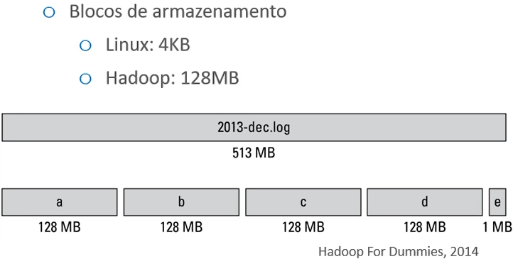

# HADOOP DISTRIBUTED FILE SYSTEM (HDFS)

## Vantagens

- Baixo custo: não existe a necessidade de adquirir sempre hardware de ponta
- Tolerante a falhas: levando em consideração que as máquinas tendem a ter hardware mais simples, as falhas são esperadas, mas o HDFS está preparado para lidar com elas
- Escalável: quanto mais nós no cluster mais armazenamento.

## Armazenamento no HDFS

- O sistema divide os arquivos em conjuntos de blocos individuais
- O sistema armazena esses blocos em vários nós replica no cluster Hadoop.
- O tamanho do bloco padrão do armazenamento do Hadoop é 128MB.

**OBS:** esse valor de 128MB pode ser mudado, mas não existe razão para fazer isso a menos que se prove que alterando esse valor vai resultar em ganho de performance.

**OBS:** devido a esses blocos de 128MB não faz sentido usar um cluster hadoop para armazenar arquivos pequenos, pois haverá muito espaço desnecessariamente ocupado.

## Confiabilidade

- O HDFS assume que cada unidade de disco e cada nó replica não é confiável 100%
- Por esse motivo ele armazena, por padrão, 3 cópias de cada bloco
- Dessa forma caso o disco que armazena uma parte do arquivo fique indisponível existirá a cópia em outro lugar

**OBS:** esse valor de 3 cópias pode ser mudado, mas ao diminui para dois aumenta muito a chance de indisponibilidade e mais do que 3 aumenta o volume do armazenamento, portanto, novamente, para alterar esse padrão é preciso provar que é vale à pena.

**OBS:** é possível definir esse número de cópias individualmente para cada tipo ou conjunto de dados, de acordo com a necessidade de cada um.

## Arquitetura Primary/replica

O nó primary é chamado no Hadoop de **NameNode** já os nós replicas chamamos de **DataNode**.

### NameNode

- Armazena os metadados da localização de todos os arquivos no cluster
- Portanto o **NameNode** é o componente central do HDFS

### DataNode

- Armazenam os dados

