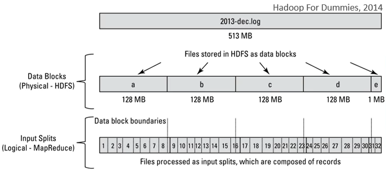
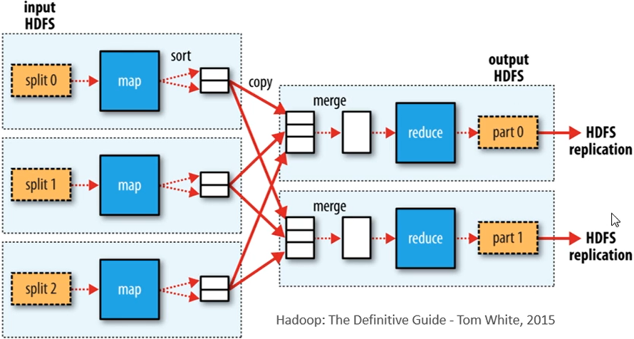
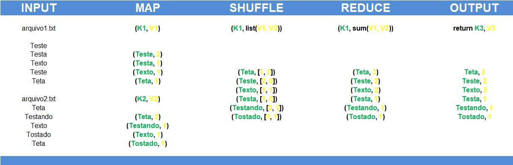

# MapReduce

- É um framework que organiza as tarefas de processamento complexas através de um cluster de computadores
- Divide o trabalho em conjunto de tarefas independentes

## Processos do MapReduce

- Split
- Map
- Shuffle
- Reduce

## Processamento

- Embora o armazenamento no HDFS seja feito, por padrão, em blocos de 128MB o processamento é feito em blocos menores
- Cada bloco de 128MB é subdividido em 8 partes lógicas

**OBS:** por esse motivo não faz sentido usar uma estrutura hadoop caso o volume de dados não esteja na ordem dos TB, PB.

## Funcionamento do MapReduce

É dividido em duas etapas mapear (map) e reduzir (reduce).

### Map

Para isso o hadoop usa o conceito de chave-valor, onde:
- Chave: informação de referência
- Valor: informação associada à essa chave-valor

No caso do exemplo acima a chave equivale a cada palavra e o valor ao número de repetições dessa palavra.

### Shuffle

- Faz o embaralhamento das listas

### Reduce

Reduz o número de resultados.

