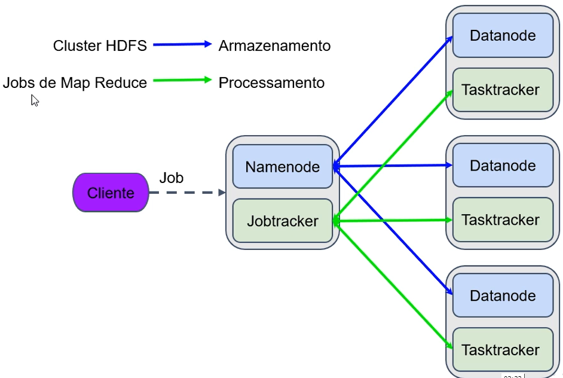

# Estrutura do Hadoop

## Armazenamento

O HDFS é responsável pelo armazenamento e as estruturas utilizadas são chamadas:
- NameNode
- DataNode

## Processamento

O MapReduce é responsável pelo processamento e as estruturas utilizadas são chamadas:
- JobTracker
- TaskTracker

## Nós e Estrutura

No Cluster Hadoop existem o nó primary e os nós replicas e as estruturas de armazenamento e processamento se posicionam da seguinte maneira:
- Primary: NameNode & JobTracker
- Replicas: DataNode & TaskTracker

