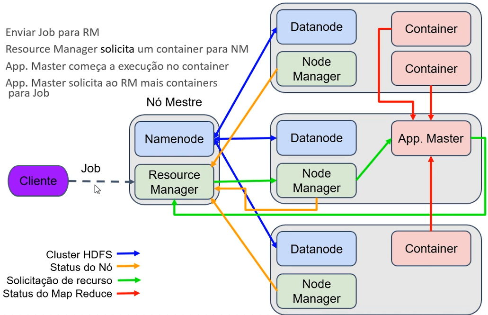

# Arquitetura YARN

- O cliente envia um job para o Resource Manager (RM) que se encontra no nó Primary
- O RM se comunica com o Node Manager (NM), presente em um dos nós replica
- O RM  solicita um certo número de contêineres ao NM
- O NM cria o número solicitado de contêineres
- Os parâmetros dos contêineres podem ser configurados
- Dentro desse primeiro contêiner é iniciado um Aplication Master (AM)
- O AM faz uma solicitação para o RM pedindo a quantidade necessária de contêineres para a execução daquele job
-  Esses contêineres criados em seguida que serão responsáveis pelo processamento do MapReduce
-  Em caso de falha nos contêineres o AM recebe a informação transmite para o RM, solicitando novos contêineres para execução da tarefa
-  O RM recebe a informação e retorna autorização para criação desses contêineres

