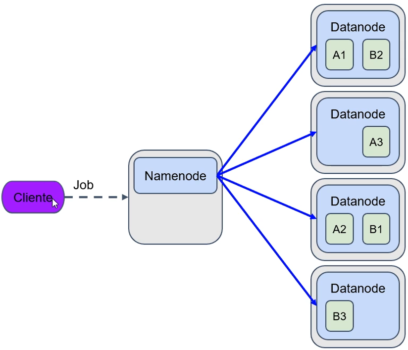
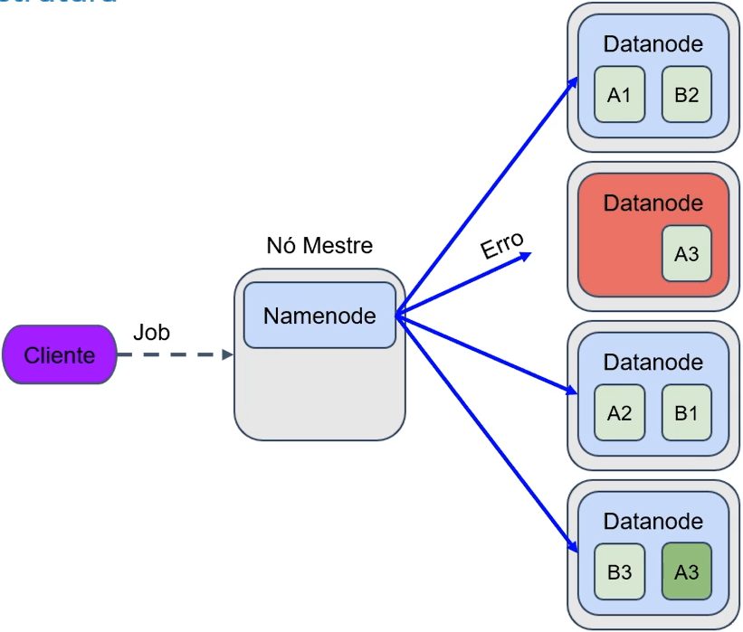

# ESTRUTURA HDFS

O cliente envia uma ação (processamento de um arquivo, armazenamento, análise de um dado) pro cluster Hadoop. Essa ação é chamada de **job**.

- Ao armazenar um dado **A** o HDFS cria 3 cópias de **A** em 3 **DataNodes** diferentes
- Esse armazenamento em nós e racks diferentes é padrão do HDFS

- O HDFS tenta equilibrar o máximo possível a distribuição dos dados nos datanodes
- Tentando evitar datanodes muito populosos, assim como datanodes vazios

- Em caso de falha o **NameNode** percebe a falha e cria outra cópia dos arquivos em outro **DataNode**
- No exemplo houve falha na terceira cópia do arquivo **A**, o **NameNode** percebeu e replicou o arquivo **A** em outro **DataNode** mantendo assim as 3 cópias do arquivo **A**
- Ainda no exemplo o **NameNode** percebeu que o último **DataNode** era o que tinha mais espaço, então por uma questão de balanceamento ele escolheu replicar o arquivo **A** justamente para aquele **DataNode**
- Quando o nó falho voltar a funcionar ele volta zerado, sem nenhuma arquivo armazenado e o HDFS mantém as cópias desse nó onde já estavam e dá prioridade para novos armazenamentos nesse nó zerado.

