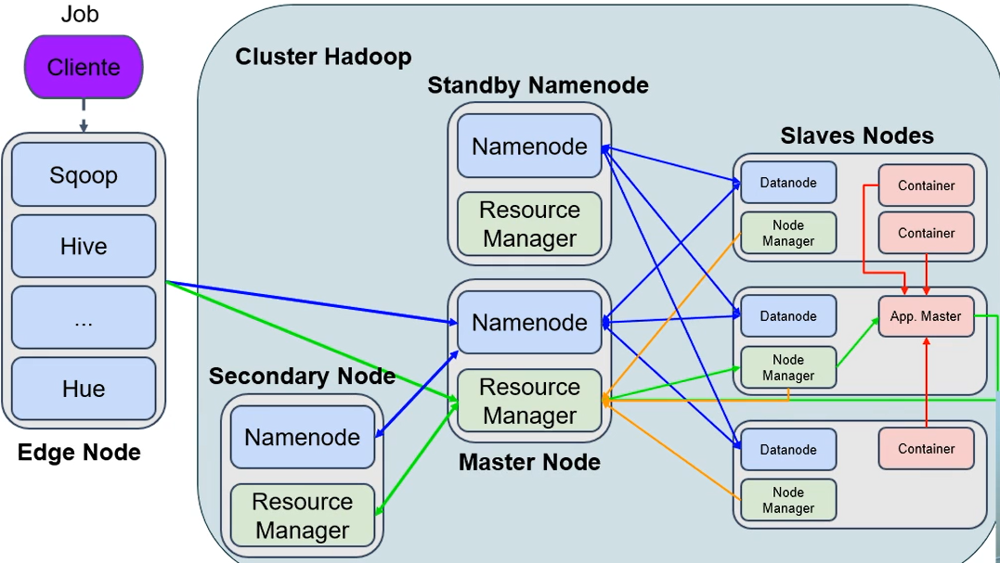

# Arquitetura do Hadoop

- O cliente envia um job para o Edge Node
- Nesse Edge Node existem várias ferramentas
- O Edge Node envia o job para o Primary Node
- O Primary Node se comunica automaticamente o Standby NameNode através de journalnodes
-  Em caso de falha do Primary Node, automaticamente o próximo job é enviado para o Standby Node
-  O Primary Node encaminha os jobs para os Replica Nodes
-  Nesses nodes acontece o armazenamento através dos DataNodes
-  Já o processamento ocorre nos Node Managers que criam contêineres para execução dos processos de MapReduce 

**OBS:** o Secundary Node não se comunica automaticamente com o Primary Node, em caso de falha do Primary Node é necessário recuperar manualmente os dados nos checkpoints do Secundary Node, por isso que essa arquitetura não é comum em ambientes de produção.

